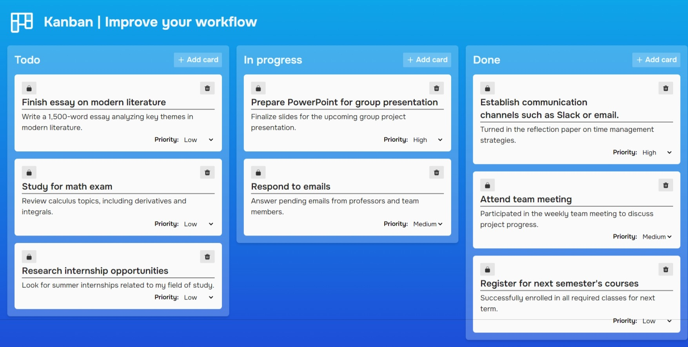

# Kanban Board App 📋🚀

## Overview

A productivity app designed to help you organize and manage your tasks efficiently. 🌟 Fully local, free, and without relying on microservices or internet connections, this Kanban app allows users to focus on their tasks without privacy concerns or hidden costs. 🛡️

With its intuitive design and essential features, this tool is perfect for breaking down projects into tasks and visualizing them across different states: To Do, In Progress, and Done. ✅

## Features

- **Fully local**: Your data stays on your device.
- **Intuitive design**: User-friendly and easy to navigate.
- **Efficient task management**: Create, edit, and move tasks between columns effortlessly.
- **Completely free**: No fees, no subscriptions, no tricks.
- **No microservices or internet**: Perfect for those prioritizing privacy and simplicity.

## Screenshots

### Board Overview

## Reporting Issues 🛠️

If you encounter any bugs or issues, please report them in the Issues section of the repository. Your feedback is invaluable for improving this app. 🚀

## Adding Features 🌟

Have an idea to improve the app?

1. Fork the project.
2. Implement your enhancement or new feature.
3. Submit a pull request, and we’ll work together to integrate your idea. 💡

Thank you for using the Kanban Board App! 🎉
